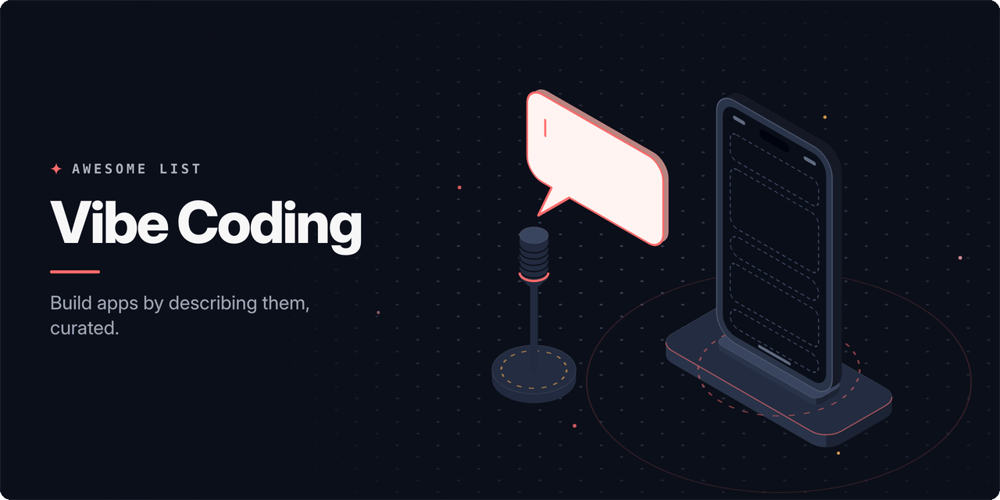

<!-- awesome:hero --><!-- /awesome:hero -->

<!-- awesome:title --><h1 align="center">Awesome Vibe Coding</h1><!-- /awesome:title -->

<!-- awesome:tagline -->Prompt-to-app builders, agentic editors, starter templates, guides and practices for building software by describing it.<!-- /awesome:tagline -->

<!-- awesome:badges -->

  
  
  

<!-- /awesome:badges -->

Vibe coding is building software by describing what you want to an AI and steering by the result, not by writing the code line by line. This list covers the app builders, agentic editors, spec tools, backends, templates, security checks and reading for working that way.

## Contents

- [App builders](#app-builders)
  - [Full-stack apps](#full-stack-apps)
  - [Mobile apps](#mobile-apps)
  - [Websites, design and games](#websites-design-and-games)
  - [Inside AI assistants](#inside-ai-assistants)
- [Open-source app builders](#open-source-app-builders)
- [Agentic editors and workspaces](#agentic-editors-and-workspaces)
- [Specs and planning](#specs-and-planning)
- [Backends](#backends)
- [Starter templates](#starter-templates)
- [Security and review](#security-and-review)
- [Guides and courses](#guides-and-courses)
- [Essays](#essays)
- [Communities and lists](#communities-and-lists)
- [Contributing](#contributing)

## App builders

### Full-stack apps

- [Anything](https://www.anything.com) - Builds web and mobile apps with a backend, payments and hosting from a description.
- [Atoms](https://atoms.dev) - Builder, formerly MGX, where a team of AI agents plans, builds and launches web apps.
- [Base44](https://base44.com) - Builds full-stack apps with a database, auth and hosting included from a chat prompt.
- [Blink](https://blink.new) - Builds and hosts websites and full-stack web or mobile apps from one prompt.
- [Bolt](https://bolt.new) - StackBlitz builder that prompts, runs, edits and deploys full-stack apps in the browser.
- [Bubble AI](https://bubble.io/ai-solutions/ai-app-generator) - Generates a Bubble app with UI, database and logic from a prompt, then edits it visually.
- [Capacity](https://capacity.so) - Asks clarifying questions, then builds and hosts a web app with accounts and payments.
- [Command.new](https://command.new) - Langbase builder that turns a prompt into a deployed AI agent with an app and API.
- [Emergent](https://emergent.sh) - Multi-agent builder that plans, codes, tests and deploys web and mobile apps.
- [Firebase Studio](https://firebase.studio) - Google's browser workspace that prototypes full-stack apps from prompts and ships to Firebase.
- [HeyBoss](https://heyboss.ai) - Builds sites and apps from a prompt, with templates, CRM, SEO and payments included.
- [Leap](https://leap.new) - Agent that builds backend-heavy apps and deploys them to your own AWS or GCP account.
- [Lovable](https://lovable.dev) - Builds full-stack web apps from chat, with a Supabase backend, GitHub sync and hosting.
- [Replit Agent](https://replit.com/products/agent) - Agent inside Replit that builds, tests and deploys apps from a plain description.
- [Rocket](https://www.rocket.new) - Researches the market for an idea, then generates and deploys web and mobile apps.
- [Same](https://same.new) - Builds new websites and full-stack apps from a prompt, or clones one from a URL.
- [Softgen](https://softgen.ai) - Builds full-stack web apps from a written description of the product.
- [Trickle](https://trickle.so) - Canvas for building apps and sites, with a database and image and video generation.
- [v0](https://v0.app) - Vercel's agent that builds Next.js apps and UIs from prompts and deploys them to Vercel.

### Mobile apps

- [a0.dev](https://a0.dev) - Builds iOS and Android apps from prompts and ships them to the App Store and Google Play.
- [Dreamflow](https://dreamflow.app) - FlutterFlow's builder for Flutter mobile apps, mixing prompts and visual editing.
- [Newly](https://newly.app) - Generates React Native code for native iOS and Android apps from a description.
- [Rork](https://rork.com) - Builds native mobile apps from a prompt.
- [Vibecode](https://www.vibecodeapp.com) - Phone and web app that builds and publishes mobile apps from a description.

### Websites, design and games

- [Claude Design](https://claude.com/product/design) - Anthropic tool that drafts prototypes, decks and one-pagers from a description.
- [Figma Make](https://www.figma.com/make/) - Figma's tool that turns prompts and existing designs into working prototypes.
- [Framer AI](https://www.framer.com/ai/) - Generates editable website pages on the Framer canvas, with CMS and hosting.
- [OpenDesign](https://github.com/nexu-io/open-design) - Open-source design workspace that turns a brief into a prototype that follows your design system.
- [Readdy](https://readdy.ai) - Website builder that generates a site with a backend, SEO tools and hosting from a prompt.
- [Rosebud](https://rosebud.ai) - Builds playable browser games from prompts or templates and publishes them.
- [Stitch](https://stitch.withgoogle.com) - Google Labs tool that generates UI designs and front-end code from text or images.
- [Superdesign](https://www.superdesign.dev) - Design agent that generates UI mockups and components from a prompt on a canvas.
- [Websim](https://websim.com) - Community where people prompt interactive web pages and games and remix each other's.

### Inside AI assistants

- [ChatGPT Sites](https://learn.chatgpt.com/docs/sites) - Builds and shares hosted websites from a conversation in ChatGPT.
- [Claude artifacts](https://claude.com/blog/build-artifacts) - Builds and shares interactive apps, including AI-powered ones, inside Claude chats.
- [Gemini Canvas](https://gemini.google/overview/canvas/) - Space in the Gemini app that turns prompts into apps, games and prototypes.
- [Google AI Studio Build](https://ai.google.dev/gemini-api/docs/aistudio-build-mode) - Build mode in AI Studio that generates full-stack Gemini apps from a prompt.
- [Opal](https://opal.google) - Google Labs experiment that builds and shares AI mini-apps from plain descriptions.

## Open-source app builders

- [Adorable](https://github.com/freestyle-sh/Adorable) - Lovable-style builder that runs each project on its own dev and production VMs.
- [AutoBE](https://github.com/wrtnlabs/autobe) - Agent that generates a TypeScript backend server from a conversation, checked by compilers.
- [bolt.diy](https://github.com/stackblitz-labs/bolt.diy) - Open-source Bolt that builds full-stack web apps with any LLM, local models included.
- [ChatDev](https://github.com/OpenBMB/ChatDev) - Multi-agent framework where LLM agents in company roles build software from a request.
- [Chef](https://github.com/get-convex/chef) - Convex app builder that writes the backend, database and auth along with the UI.
- [Dyad](https://github.com/dyad-sh/dyad) - Local desktop app builder that works with any model, an open alternative to Lovable.
- [Fragments](https://github.com/e2b-dev/fragments) - Next.js template for apps fully generated by AI, run in E2B sandboxes.
- [GPT Pilot](https://github.com/Pythagora-io/gpt-pilot) - Agent that builds a whole app step by step and asks the developer to review each part.
- [LlamaCoder](https://github.com/Nutlope/llamacoder) - Open take on Claude artifacts that turns one prompt into a small React app.
- [MetaGPT](https://github.com/FoundationAgents/MetaGPT) - Multi-agent framework that turns a one-line requirement into a PRD, design and code.
- [Napkins](https://github.com/Nutlope/napkins) - Turns a screenshot or wireframe into a working React app.
- [Onlook](https://github.com/onlook-dev/onlook) - Visual editor for designers that builds and styles React apps with AI.
- [Open Lovable](https://github.com/firecrawl/open-lovable) - Firecrawl app that recreates any website as a React app from its URL.
- [OpenUI](https://github.com/wandb/openui) - Describe a UI in words, see it rendered live, then export it as HTML or React.
- [OpenVibeCoding](https://github.com/TencentCloudBase/OpenVibeCoding) - Self-hosted platform on Tencent CloudBase that generates, previews and deploys apps.
- [Puter AI Builder](https://github.com/HeyPuter/builder) - Builds sites and apps on Puter.js, which supplies auth, storage and hosting.
- [React Native Vibe Code SDK](https://github.com/react-native-vibe-code/react-native-vibe-code-sdk) - Kit for running your own text-to-app builder for React Native apps.
- [sandboxd](https://github.com/tastyeffectco/sandboxd) - Self-hosted builder where an agent builds apps in isolated sandboxes on your server.
- [ScreenCoder](https://github.com/leigest519/ScreenCoder) - Turns a UI screenshot into editable HTML and CSS using several agents.
- [Screenshot to Code](https://github.com/abi/screenshot-to-code) - Converts screenshots and mockups into HTML, Tailwind, React or Vue code.
- [tinykit](https://github.com/tinykit-studio/tinykit) - Self-hosted agentic app builder with a realtime database and storage included.
- [VibeSDK](https://github.com/cloudflare/vibesdk) - Cloudflare's platform for running your own vibe coding service on Workers.

## Agentic editors and workspaces

- [Antigravity](https://antigravity.google) - Google's agentic IDE for building software with coding agents.
- [Conductor](https://www.conductor.build) - Runs a team of coding agents in isolated workspaces, locally or in the cloud.
- [Cursor](https://cursor.com) - AI code editor whose agent plans and makes multi-file changes from chat.
- [Devin Desktop](https://devin.ai/desktop) - Cognition's editor, formerly Windsurf, for directing local and cloud coding agents.
- [HAPI](https://github.com/tiann/hapi) - App for driving Claude Code, Codex and other agents from a phone or browser.
- [Kiro](https://kiro.dev) - AWS editor that turns prompts into specs, then builds them with agents.
- [Orca](https://github.com/stablyai/orca) - Workspace for running a fleet of coding agents in parallel on your own subscriptions.
- [Qoder](https://qoder.com) - Agentic IDE that hands whole tasks to autonomous coding agents.
- [Superset](https://github.com/superset-sh/superset) - Desktop app that runs many coding agents at once, each in its own git worktree.
- [Tempo](https://www.tempo.new) - Turns customer feedback, issues and requirements into reviewed pull requests with agents.
- [Trae](https://www.trae.ai) - ByteDance's AI IDE whose agent can build a project from a description.
- [Vibe Kanban](https://github.com/BloopAI/vibe-kanban) - Kanban board that hands tasks to coding agents and lets you review their results.

## Specs and planning

- [Agent OS](https://github.com/buildermethods/agent-os) - Writes your codebase standards and feature specs into files that coding agents follow.
- [AGENTS.md](https://agents.md) - Open format for a README-style file that tells coding agents how to work in a repo.
- [AI Dev Tasks](https://github.com/snarktank/ai-dev-tasks) - Prompt files that turn a feature idea into a PRD, then a task list an agent works through.
- [Backlog.md](https://github.com/MrLesk/Backlog.md) - Markdown task board in your git repo that people and AI agents share.
- [BMAD Method](https://github.com/bmad-code-org/BMAD-METHOD) - Agile method with analyst, PM, architect and developer agents that plan and build a project.
- [CodeGuide](https://www.codeguide.dev) - Generates PRDs, tech specs and wireframes for AI coding tools from an idea.
- [Context Engineering Intro](https://github.com/coleam00/context-engineering-intro) - Template for giving a coding assistant enough context to build a feature in one pass.
- [OpenSpec](https://github.com/Fission-AI/OpenSpec) - Spec-driven workflow that agrees on a change proposal before the agent writes code.
- [Ralph](https://github.com/snarktank/ralph) - Loop that reruns a coding agent until every item in a PRD is done.
- [Spec Kit](https://github.com/github/spec-kit) - GitHub toolkit for spec-driven development: write the spec, plan, then let an agent build.
- [Spec Workflow MCP](https://github.com/Pimzino/spec-workflow-mcp) - MCP server that walks an agent through requirements, design and tasks, with a dashboard.
- [Task Master](https://github.com/eyaltoledano/claude-task-master) - Breaks a PRD into tasks that Cursor, Lovable, Windsurf and other agents work through.
- [Vibe Check](https://github.com/TexasBedouin/vibe-check) - Skill that takes a beginner from a vague app idea to a tested, buildable plan.
- [Vibe Coding Prompt Template](https://github.com/KhazP/vibe-coding-prompt-template) - Prompts and workflow for writing a PRD, tech design and MVP plan with an LLM.

## Backends

- [AipexBase](https://github.com/kuafuai/aipexbase) - Backend-as-a-service that gives vibe-coded front ends a backend with no backend code.
- [Convex](https://github.com/get-convex/convex-backend) - Reactive TypeScript database and backend that ships guidance for AI coding tools.
- [InstantDB](https://github.com/instantdb/instant) - Backend with auth, permissions, storage and realtime sync, built for AI-coded apps.
- [Neon](https://neon.com) - Serverless Postgres that app-building platforms create per project through an API.
- [Prisma Postgres](https://www.prisma.io/postgres) - Managed Postgres with zero cold starts that agents create with npx create-db@latest.
- [Supabase](https://github.com/supabase/supabase) - Postgres backend with auth, storage and APIs that Lovable, Bolt and v0 connect to.

## Starter templates

- [Awesome CursorRules](https://github.com/PatrickJS/awesome-cursorrules) - Rules files per framework that set how Cursor's agent writes code in a project.
- [Lovable Templates](https://lovable.dev/templates) - Starter apps and sites to remix in Lovable instead of prompting from scratch.
- [Open SaaS](https://github.com/wasp-lang/open-saas) - Free Wasp SaaS starter with auth, payments and admin, set up for AI coding agents.
- [v0 Templates](https://v0.app/templates) - Community and Vercel templates to fork in v0 as the start of a project.
- [Vibe Coding Production Kit](https://github.com/Moeeryani/Vibe-Coding-Production-Kit) - CLI that adds specs, tests, review and CI steps to a project built with agents.
- [Vibe Coding Prompt Structures](https://github.com/KingLeoJr/awesome-vibe-coding-prompt-code-templates) - File layouts and prompts for dozens of apps, ready to hand to an AI builder.
- [Vibe Coding Repository Standard](https://github.com/cz1993/vibe-coding-repository-standard) - Starter and agent workflows that make a vibe-coded repo readable and safe to change.
- [Vibe Coding Starter Kit](https://github.com/backblaze-b2-samples/vibe-coding-starter-kit) - Backblaze full-stack starter for vibe-coded apps that handle file uploads.
- [Vibe to Production](https://github.com/muyen/vibe-to-prod) - Full-stack template with CI/CD, security, tests and monitoring in place from day one.

## Security and review

- [Base44 auth bypass](https://www.wiz.io/blog/critical-vulnerability-base44) - Wiz report of a flaw that let outsiders into private apps built on Base44.
- [CVE-2025-48757](https://mattpalmer.io/posts/2025/05/statement-on-CVE-2025-48757/) - Disclosure of missing row-level security that exposed data in many Lovable-built apps.
- [GenAI Code Security Report](https://www.veracode.com/resources/analyst-reports/2025-genai-code-security-report/) - Veracode study of how often AI-generated code ships with security flaws.
- [Lovable Security](https://docs.lovable.dev/features/security) - How Lovable scans generated apps for exposed data and weak database rules.
- [pyscn](https://github.com/ludo-technologies/pyscn) - Python analyzer that finds dead code, clones and complexity in AI-written code.
- [Supabase Advisors](https://supabase.com/docs/guides/observability/advisors) - Supabase checks that flag missing row-level security and other risky settings.
- [Vibe Check Security](https://github.com/benavlabs/vibe-check) - Security rules for your AI tool plus a scanner and checklist for a running app.
- [Vibe Security](https://github.com/raroque/vibe-security-skill) - Agent skill that audits vibe-coded apps for secrets, missing RLS and other common holes.
- [Vibe Security Radar](https://github.com/HQ1995/vibe-security-radar) - Georgia Tech catalog of public vulnerabilities whose root cause is AI-written code.
- [VibePenTester](https://github.com/firetix/vibe-coding-penetration-tester) - Security agents that probe a running web app and report the flaws they confirm.
- [VibeSec](https://github.com/BehiSecc/VibeSec-Skill) - Skill that has Claude write code that avoids common web vulnerabilities.
- [Vibeship Scanner](https://github.com/vibeforge1111/vibeship-scanner) - Scans a GitHub repo for vulnerabilities and writes fix prompts for your AI tool.

## Guides and courses

- [AI Code Guide](https://github.com/automata/aicodeguide) - Roadmap for starting to code with AI, from picking tools to working habits.
- [Awesome Vibe Coding Guide](https://github.com/analyticalrohit/awesome-vibe-coding-guide) - Practices and tips for clear prompts and controlled, step-by-step AI builds.
- [Bolt prompting guide](https://support.bolt.new/best-practices/prompting-effectively) - Bolt's advice on writing prompts that produce better apps.
- [CS146S: The Modern Software Developer](https://themodernsoftware.dev) - Stanford course on building software with AI coding tools and agents.
- [Easy Vibe](https://github.com/datawhalechina/easy-vibe) - Datawhale course that teaches AI coding by shipping real products, in ten languages.
- [Lovable prompting guide](https://docs.lovable.dev/prompting/prompting-one) - Lovable's handbook for structuring prompts and iterating on an app.
- [Ultimate Guide to Vibe Coding](https://github.com/EnzeD/vibe-coding) - Step-by-step method for building a game or app with Claude Code or Codex.
- [Vibe Coding 101 with Replit](https://www.deeplearning.ai/courses/vibe-coding-101-with-replit) - DeepLearning.AI short course on building and deploying apps with Replit Agent.
- [Vibe coding explained](https://cloud.google.com/discover/what-is-vibe-coding) - Google Cloud's primer on what vibe coding is and how to start.
- [Vibe Coding for Dummies](https://github.com/cporter202/vibe-coding-for-dummies) - Free beginner course on shipping a first app by describing it to AI tools.
- [Vibe Vibe](https://github.com/datawhalechina/vibe-vibe) - Chinese tutorial that takes a non-programmer from an idea to a full-stack product.
- [VibeWise](https://github.com/nykooi1/vibe-wise) - Claude Code plugin that has you design each step so you learn while the AI writes.
- [What is vibe coding?](https://replit.com/blog/what-is-vibe-coding) - Replit's walkthrough of taking an app from idea to deploy by prompting.

## Essays

- [A Year of Vibes](https://lucumr.pocoo.org/2025/12/22/a-year-of-vibes/) - Armin Ronacher looks back on a year of building software with agents.
- [Augmented coding: beyond the vibes](https://newsletter.kentbeck.com/p/augmented-coding-beyond-the-vibes) - Kent Beck on keeping tests and design standards while an agent writes the code.
- [Collins Word of the Year 2025](https://blog.collinsdictionary.com/language-lovers/collins-word-of-the-year-2025-ai-meets-authenticity-as-society-shifts/) - Collins names vibe coding its word of the year for 2025.
- [Karpathy's vibe coding post](https://x.com/karpathy/status/1886192184808149383) - The February 2025 post that named vibe coding: give in to the vibes, forget the code.
- [Not all AI-assisted programming is vibe coding](https://simonwillison.net/2025/Mar/19/vibe-coding/) - Simon Willison on where vibe coding ends and careful AI-assisted work begins.
- [Ralph Wiggum as a "software engineer"](https://ghuntley.com/ralph/) - Geoffrey Huntley's technique of running an agent in a loop until the spec is met.
- [Revenge of the junior developer](https://sourcegraph.com/blog/revenge-of-the-junior-developer) - Steve Yegge on the waves of AI coding, from chat to fleets of agents.
- [Software Is Changing (Again)](https://www.youtube.com/watch?v=LCEmiRjPEtQ) - Karpathy's talk on Software 3.0, where plain English is the programming language.
- [Speaking things into existence](https://www.oneusefulthing.org/p/speaking-things-into-existence) - Ethan Mollick tries vibe coding and weighs what it means for non-programmers.
- [The Way of Code](https://www.thewayofcode.com/) - Rick Rubin's take on the Tao Te Ching for vibe coders, with art you can remix by prompt.
- [Understanding Spec-Driven Development](https://martinfowler.com/articles/exploring-gen-ai/sdd-3-tools.html) - Birgitta Böckeler compares Kiro, Spec Kit and Tessl.
- [Vibe Coding (book)](https://itrevolution.com/product/vibe-coding-book/) - Gene Kim and Steve Yegge on building production-grade software with AI.
- [Vibe coding is not the same as AI-assisted engineering](https://addyo.substack.com/p/vibe-coding-is-not-the-same-as-ai) - Addy Osmani on why prototypes and production code need different habits.
- [Vibe coding MenuGen](https://karpathy.bearblog.dev/vibe-coding-menugen/) - Karpathy's account of vibe coding a real app and where the hard parts were.
- [Vibe coding on Wikipedia](https://en.wikipedia.org/wiki/Vibe_coding) - Encyclopedia entry on the term, its origin and its critics.
- [Vibe engineering](https://simonwillison.net/2025/Oct/7/vibe-engineering/) - Simon Willison's name for seasoned engineers using agents while staying accountable.

## Communities and lists

- [Awesome Vibe Coding (AI For Developers)](https://github.com/awesome-vibe-coding/awesome-vibe-coding) - Another list of vibe coding tools and articles, with a searchable site.
- [Awesome Vibe Coding (Filipe Calegario)](https://github.com/filipecalegario/awesome-vibe-coding) - Long-running list of vibe coding tools and references, in five languages.
- [r/lovable](https://www.reddit.com/r/lovable/) - Subreddit for people building apps with Lovable.
- [r/vibecoding](https://www.reddit.com/r/vibecoding/) - Subreddit for sharing vibe-coded projects, tools and workflows.
- [Vibe Jam](https://vibejam.com) - Yearly game jam, started by Pieter Levels, for games written mostly by AI.

## Contributing

Contributions are welcome. Read the [contribution guidelines](contributing.md) first.

<!-- awesome:maintainer -->
Maintained by [Ian Wiedenman](https://github.com/ianwieds).
<!-- /awesome:maintainer -->
